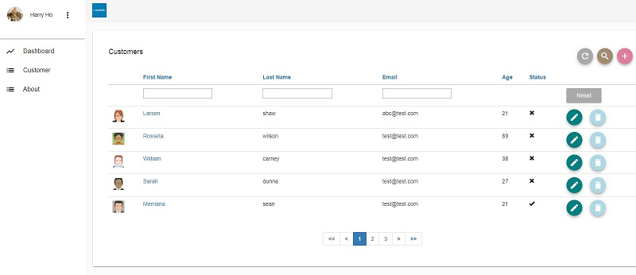
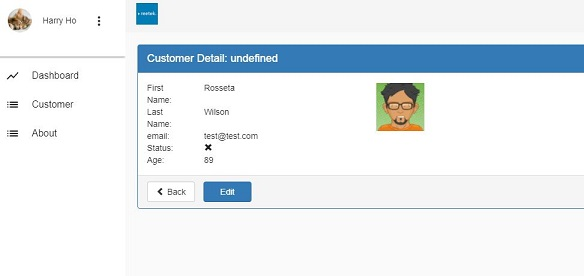

# Reetek Angular CRM

> A simple reusable CRM project for real-world business based on Angular 4, Angular-Material & Bootstrap 3. 

This project starts from a popular starter project [AngularClass/Angular-Starter] (https://github.com/AngularClass/angular-starter). The goal of this project is to create reusable project for real-world business. To achieve this target, we need a solution which should include authentication process, restful API feature with token support and simple but elegant UI design. 

There is another similar project built on the Vue.js. If you are looking for reusable CRM project with Vue.js, please clone from [here](https://github.com/harryho/vue2crm.git).

#### Features

* This project is built on the top of AngularClass/Angular-Starter. 
* The UI part of this project combine Angular-Material and Bootstrap 3. Because the controls from Angular-Material is very limited, there are a few extra components require Bootstrap 3 for help. 
* This project includes ng-charts, pagination, progress-bar, confirmation dialog, etc. features.
* It uses Json-Server as fake Restful API. (You can simple replace it with your own API)

#### Screenshots






## Build Setup

``` bash

# Clone project
git clone https://github.com/harryho/ng4crm.git


# prepare Json-Server as fake Restful API

## clone json-server to folder server
cd ng4crm
git clone https://github.com/typicode/json-server.git server
cd server
npm install json-server

## replace db.json and routes.json files
copy /Y ..\db\*.json

## start json-server
json-server -p 5354 db.json

## You will see the following output. You can test the URLs via browser.
##
## \{^_^}/ hi!                        
##                                    
## Loading db.json                    
## Done                               
##                                    
## Resources                          
## http://localhost:5354/token        
## http://localhost:5354/customers    
## http://localhost:5354/orders       
##                                    
## Home                               
## http://localhost:5354              

# install dependences for Angular 4 CRM
cd ..

# WINDOWS only. In terminal as administrator
npm install -g node-pre-gyp

# install the repo with npm
npm install

# start the server
npm start

# serve with hot reload at localhost:3000
npm run server:dev:hmr

```

# Welcome to fork or clone!

For detailed explanation on how things work, checkout following links please.

* [angular](https://angular.io/)
* [angular-material](https://material.angular.io/)
* [bootstrap](http://getbootstrap.com/)
* [ng-charts](https://github.com/valor-software/ng2-charts)
